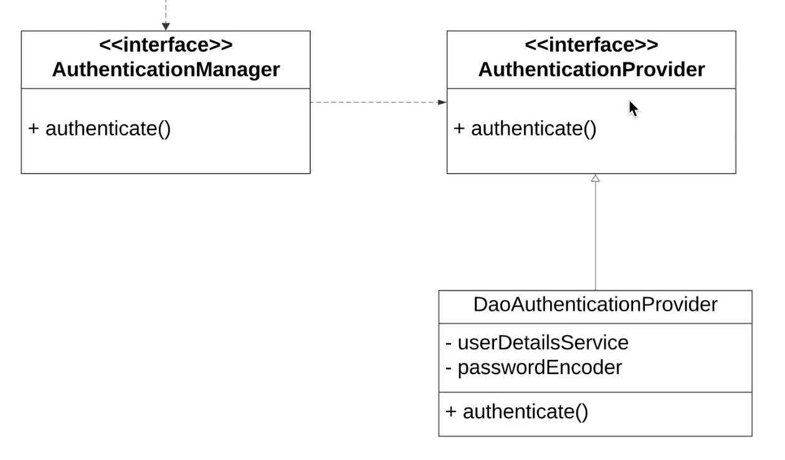

# Spring Security
In SpringSecurity (`spring-boot-starter-security`), there is an interface called `AuthenticationManager` which is the entrypoint for `Authentication`. This interface defines a single method called `authenticate`.

Spring Security comes with an implementation of this method - that implementation forwards the request to an `AuthenticationProvider`. This is where the actual authentication happens.

There are multiple implementations of this interface in Spring Security. The one that is used the most is the `DaoAuthenticationProvider`. Deo is short for Data Access Object. 

There are other Authentication Providers for using other types of authenticatoin. For example:
- `Ldap`
- `ActiveDirectory`
- `oAuth`

The Authentication Manager simply forwards the authentication request to a list of Authentication Providers, so an application can support multiple authentication methods.

## The Dao Authentication Provider
The Dao Authentication Provider is the most common implementation. This implementation uses two objects to authenticate a user:
- `UserDetailsService`
- `PasswordEncoder`

